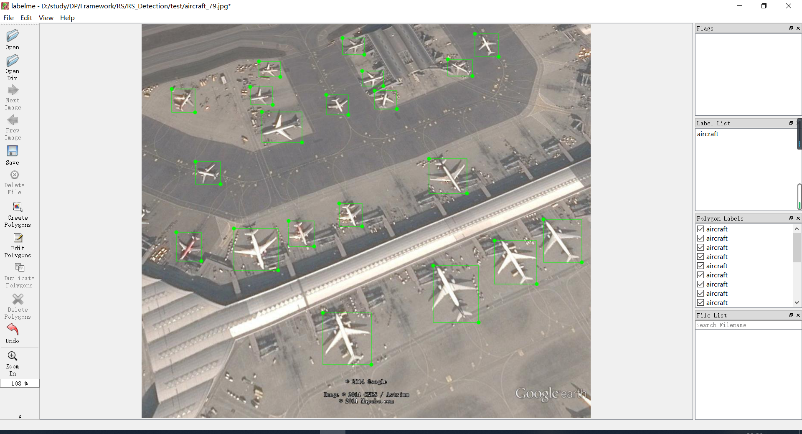
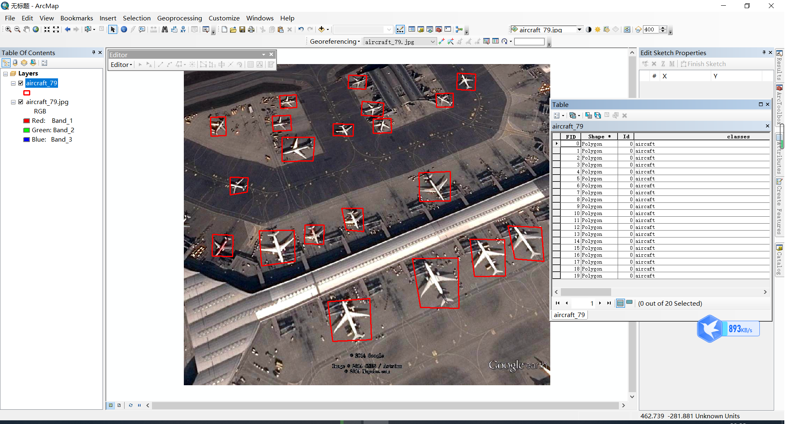

# 目标检测样本数据分析


[TOC]

----

## 1. 样本格式转化

目标检测样本格式五花八门，常见的有voc、coco格式，也有自定义的txt、csv等格式。不管什么格式，无非就是记录下图像路径，图像长宽，每个目标的坐标位置，是否难检等信息。我这里统一转化为txt，并且整个数据集的目标写在一个txt里面，每一行记录一个图像的目标信息，格式如下：

图像地址 宽度,长度 目标Ax1,目标Ay1,目标Ax2,目标Ay2,类别,难易 目标Bx1,目标By1,目标Bx2,目标By2,类别,难易度 。。。

D:/data/src/P0003.png 1280,659 597,20,733,116,0 250,125,367,210,0 245,388,381,516,0 234,546,366,652,0

下面是他们的转化过程，由于遥感图像特殊性，我们增加了矢量格式shp和geojson方便可视化展示。

### 1.1 voc_to_coco

```python
import 
```

### 1.2 coco_to_voc

```python
import os
```


### 1.3 voc_to_txt

```python
import sys
import os
import glob
import xml.etree.ElementTree as ET
def voc_to_txt(xml,outfile):
    with open(outfile, "w") as new_f:
        root = ET.parse(xml).getroot()
        filename = root.find('filename').text
        size = root.find('size')
        width = size.find('width').text
        height = size.find('height').text
        new_f.write("%s %s,%s "%(filename,width,height))
        for obj in root.findall('object'):
            if obj.find('difficult')!=None:
                difficult = obj.find('difficult').text
                if int(difficult)==1:
                    continue
            obj_name = obj.find('name').text
            bndbox = obj.find('bndbox')
            left = bndbox.find('xmin').text
            top = bndbox.find('ymin').text
            right = bndbox.find('xmax').text
            bottom = bndbox.find('ymax').text
            new_f.write("%s,%s,%s,%s,%s " % (left, top, right, bottom,obj_name))
        new_f.write('\n')
if __name__ == '__main__':
    xml = "./test/aircraft_79.xml"
    outfile = './test/aircraft_79.txt'
    voc_to_txt(xml,outfile)
```


### 1.4 coco_to_txt

```python
import numpy as np
import os
import glob
import json

def json_to_txt(json_file,ourfile):
    file = open(outfile,'w')
    with open(json_file) as f:
        lines = json.load(f)
        filename = lines['imagePath']
        width = lines['imageWidth']
        height = lines['imageHeight']
        file.write("%s %s,%s" % (filename, width, height))#注意空格
        lines = lines["shapes"]
        for line in lines:
            list = line['points']
            xmin = int(list[0][0])
            ymin = int(list[0][1])
            xmax = int(list[1][0])
            ymax = int(list[1][1])
            cla = line['label']
            b = (xmin, ymin, xmax, ymax, cla)
            file.write(' ' + ",".join([str(a) for a in b]))
        file.write('\n')
    file.close()

if __name__ == '__main__':
    json_file= './test/aircraft_79.json'
    outfile = './test/airraft_79.json.txt'
    json_to_txt(json_file,outfile)
```


### 1.5 shp_to_txt

在arcgis/Qgis中标注的数据可以直接转化为训练数据txt，这里顺便切图

### 1.6 txt_to_geojson

txt数据转成geojson格式方便web端加载展示

### 1.7 txt_to_shp


## 2.目标可视化

### 2.1 labelme可视化

安装labelme



### 2.2 arcmap 可视化




### 2.3 自定义可视化


## 3. 图像分布


## 4. 目标详情


## 5. anchor分布


## 6.  数据增强


