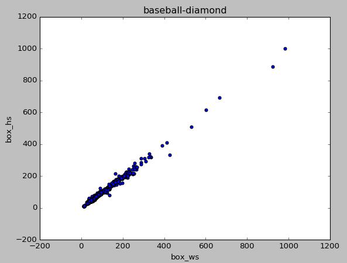

# 目标检测样本数据分析


[TOC]

----

## 1. 样本格式转化

目标检测样本格式五花八门，常见的有voc、coco格式，也有自定义的txt、csv等格式。不管什么格式，无非就是记录下图像路径，图像长宽，每个目标的坐标位置，是否难检等信息。我这里统一转化为txt，并且整个数据集的目标写在一个txt里面，每一行记录一个图像的目标信息，格式如下：

图像地址 宽度,长度 目标Ax1,目标Ay1,目标Ax2,目标Ay2,类别,难易 目标Bx1,目标By1,目标Bx2,目标By2,类别,难易度 。。。

D:/data/src/P0003.png 1280,659 597,20,733,116,0 250,125,367,210,0 245,388,381,516,0 234,546,366,652,0

下面是他们的转化过程，由于遥感图像特殊性，我们增加了矢量格式shp和geojson方便可视化展示。

### 1.1 voc_to_txt

```python
import sys
import os
import glob
import xml.etree.ElementTree as ET
def voc_to_txt(xml,outfile):
    with open(outfile, "w") as new_f:
        root = ET.parse(xml).getroot()
        filename = root.find('filename').text
        size = root.find('size')
        width = size.find('width').text
        height = size.find('height').text
        new_f.write("%s %s,%s "%(filename,width,height))
        for obj in root.findall('object'):
            if obj.find('difficult')!=None:
                difficult = obj.find('difficult').text
                if int(difficult)==1:
                    continue
            obj_name = obj.find('name').text
            bndbox = obj.find('bndbox')
            left = bndbox.find('xmin').text
            top = bndbox.find('ymin').text
            right = bndbox.find('xmax').text
            bottom = bndbox.find('ymax').text
            new_f.write("%s,%s,%s,%s,%s " % (left, top, right, bottom,obj_name))
        new_f.write('\n')
if __name__ == '__main__':
    xml = "./test/aircraft_79.xml"
    outfile = './test/aircraft_79.txt'
    voc_to_txt(xml,outfile)
```


### 1.2 coco_to_txt

```python
import numpy as np
import os
import glob
import json

def json_to_txt(json_file,ourfile):
    file = open(outfile,'w')
    with open(json_file) as f:
        lines = json.load(f)
        filename = lines['imagePath']
        width = lines['imageWidth']
        height = lines['imageHeight']
        file.write("%s %s,%s" % (filename, width, height))#注意空格
        lines = lines["shapes"]
        for line in lines:
            list = line['points']
            xmin = int(list[0][0])
            ymin = int(list[0][1])
            xmax = int(list[1][0])
            ymax = int(list[1][1])
            cla = line['label']
            b = (xmin, ymin, xmax, ymax, cla)
            file.write(' ' + ",".join([str(a) for a in b]))
        file.write('\n')
    file.close()

if __name__ == '__main__':
    json_file= './test/aircraft_79.json'
    outfile = './test/airraft_79.json.txt'
    json_to_txt(json_file,outfile)
```

### 1.3 shp_to_txt

在arcgis/Qgis中标注的矢量shp数据可以直接转化为训练数据txt。一般遥感图像尺寸较大，这里转化txt的同时增加裁剪功能，遍历每个目标，以一定大小的框（下图红框）去裁剪crop，得到目标检测网络需要的尺寸。

  --------------


```python
from osgeo import gdal, ogr, osr
import numpy as np
import os
def read_tif(filename):
    dataset = gdal.Open(filename)
    im_width = dataset.RasterXSize
    im_height = dataset.RasterYSize
    im_geotrans = dataset.GetGeoTransform()
    im_proj = dataset.GetProjection()
    # im_data = dataset.ReadAsArray(0, 0, im_width, im_height)
    # im_data = dataset.ReadAsArray(buf_xsize=int(im_width/size),buf_ysize=int(im_height/size))
    del dataset
    return im_proj, im_geotrans, im_width,im_height
def write_tif(filename,im_proj,im_geotrans,im_data):
    if 'int8' in im_data.dtype.name:
        datatype = gdal.GDT_Byte
    elif 'int16' in im_data.dtype.name:
        # datatype = gdal.GDT_UInt16
        datatype = gdal.GDT_Byte
    else:
        # datatype = gdal.GDT_Float32
        datatype = gdal.GDT_Byte

    if len(im_data.shape)==3:
        im_bands,im_height,im_width = im_data.shape
    else:
        im_bands,(im_height,im_width) = 1,im_data.shape
    driver = gdal.GetDriverByName('GTiff')
    dataset = driver.Create(filename,im_width,im_height,im_bands,datatype)
    dataset.SetGeoTransform(im_geotrans)
    dataset.SetProjection(im_proj)
    if im_bands == 1:
        dataset.GetRasterBand(1).WriteArray(im_data)
    else:
        for i in range(im_bands):
            dataset.GetRasterBand(i+1).WriteArray(im_data[i])
    del dataset

def shp_to_txt(img, shapefile, txt):

    file = open(txt, 'w')
    prj,geo,w,h = read_tif(img)
    file.write("%s %s,%s" % (img, w, h))  # 注意空格
    if prj=="":
        zx=-1
    else:
        zx=1
    left=geo[0]
    up = geo[3]
    pixx = geo[1]
    pixy = geo[5]*zx
    vector = ogr.Open(shapefile)
    layer = vector.GetLayer()
    n = layer.GetFeatureCount()
    lists = []
    for i in range(n):
        feat = layer.GetFeature(i)
        poly=feat.GetGeometryRef()
        box = poly.GetEnvelope()
        x1 = int((box[0]-left)//pixx)
        y2 = int((box[2]-up)//pixy)
        x2 = int((box[1]-left)//pixx)
        y1 = int((box[3]-up)//pixy)
        feature = layer.GetFeature(i)
        name = feature.GetField("classes")
        # print(name)
        object = (x1,y1,x2,y2,name)
        print(object)
        file.write(' ' + ",".join([str(a) for a in object]))
        lists.append([x1,y1,x2,y2,name])
    ##何时换行
    file.write('\n')
    file.close()
    return lists
def read_tif_size(filename):
    srs = osr.SpatialReference()
    srs.SetWellKnownGeogCS('WGS84')
    dataset = gdal.Open(filename)
    # dataset = gdal.AutoCreateWarpedVRT(dataset, None, srs.ExportToWkt(),gdal.GRA_NearestNeighbour)# , gdal.GRA_Bilinear)

    im_width = dataset.RasterXSize
    im_height = dataset.RasterYSize
    # print(im_width,im_height)
    im_geotrans = dataset.GetGeoTransform()
    im_proj = dataset.GetProjection()
    # print(im_width,im_height)
    # print(im_geotrans)
    return im_width,im_height,im_geotrans,im_proj,dataset

def clip_image(image,lists, outdir,size):
    name = os.path.split(image)[1][:-4]
    if not os.path.exists(outdir):
        os.mkdir(outdir)
    label2 = lists
    h, w, geo, prj, dataset = read_tif_size(image)
    list_file = open(os.path.join(outdir,'all.txt'), 'w')

    i=0
    for box in label2:
        outdirfile = os.path.join(outdir, name + str(i) + '.tif').replace('\\','/')
        list_file.write("%s %s,%s" % (outdirfile, size, size))#注意空格
        x1, y1,x2,y2,_ = box
        if True:
            bx = np.random.randint(max(x2 - size,0), min(x1,h-size))
            by = np.random.randint(max(y2 - size,0), min(y1,w-size))
            bbox = [bx, by, bx + size, by + size]
            def get_label(labels,bbox):
                def do(lab,bbox):
                    pix_label = []
                    def do2(x):
                        if x < 0:
                            return 0
                        elif x > size:
                            return size
                        else:
                            return x
                    x1,y1,x2,y2,_ = lab
                     # = lab[1]
                    xx1 = x1-bbox[0]
                    yy1 = y1-bbox[1]
                    xx2 = x2-bbox[0]
                    yy2 = y2-bbox[1]
                    pix_label.append(do2(xx1))
                    pix_label.append(do2(yy1))
                    pix_label.append(do2(xx2))
                    pix_label.append(do2(yy2))
                    pix_label.append(box[-1])
                    # pix_label.append([do2(xx1),do2(yy1),do2(xx2),do2(yy2)])
                    return pix_label
                center = [[(label[0] + label[2]) // 2, (label[1] + label[3]) // 2] for label in labels]

                label =[]
                for cen in center:
                    if bbox[0]<=cen[0]<=bbox[2] and bbox[1]<=cen[1]<=bbox[3]:
                        lab=labels[center.index(cen)]
                        lab=do(lab,bbox)
                        label.append(lab)
                return np.array(label)
            boxs = get_label(label2, bbox)
            # list_file = open(outdirfile, 'w')
            for box in boxs:
                b = [box[0],box[1],box[2],box[3],box[-1]]
                b = ' '+",".join(b)
                list_file.write(b)
                # list_file.write('\n')
            geo2 = list(geo)
            geo2[0]=geo[0]+bbox[0]*geo[1]
            geo2[3]=geo[3]+bbox[1]*geo[-1]
            boxxx = dataset.ReadAsArray(bbox[0],bbox[1],bbox[2]-bbox[0],bbox[3]-bbox[1])
            write_tif(outdirfile,prj,geo2,boxxx)
            i+=1
        list_file.write('\n')


if __name__=='__main__':
    ###有投影的
    img = './test/clip.tif'
    shapefile = './test/clip.shp'
    txt = './test/clip.json.txt'

    ###无投影的
    # img = './test/aircraft_79.jpg'
    # shapefile = './test/aircraft_79.shp'
    # txt = './test/aircraft_79.shp.txt'

    boxs = shp_to_txt(img, shapefile, txt)
    clip_image(img,boxs,'./test/out',512)
```

### 1.4 可视化vis_txt

txt 格式的可视化如下：


```python
import numpy as np
import os
from PIL import Image,ImageFont, ImageDraw
Image.MAX_IMAGE_PIXELS = None
import glob
import tqdm
import cv2
import pandas as pd

import matplotlib.pyplot as plt

def read_txt(str_text):
    """
    自定义解析方法
    :param str_text: 
    :return: 
    """
    list = []
    with open(str_text) as f:
        line = f.readline()
        while line:
            # 消除空行
            if line.isspace():
                line = f.readline()
                continue
            #消除换行
            if '\n' in line:
                line = line.strip("\n")
            #消除不需要的行
            if line[0] in ["i","g"]:
                line = f.readline()
                continue
            list.append(line)
            line = f.readline()
    return list
def vis_label(txt,class_name,xz=False):

    """
    可视化标签
    :param txt: 记录标签的txt每一行格式为：图像路径 宽,高 x1,y1,x2,y2，classname
    :param class_name: classname 列表
    :param xz: 旋转框或者水平框
    :return: image
    """
    colors_tableau = [(255, 0, 0), (31, 119, 180), (174, 199, 232), (255, 127, 14), (255, 187, 120),
                      (44, 160, 44), (152, 223, 138), (214, 39, 40), (255, 152, 150),
                      (148, 103, 189), (197, 176, 213), (140, 0, 75), (196, 156, 148),
                      (227, 119, 194), (247, 182, 210), (127, 127, 127), (199, 199, 199),
                      (188, 189, 34), (219, 219, 141), (23, 190, 207), (158, 218, 229)]

    line = txt.split(' ')
    image_name = line[0]
    print(image_name)
    ## 从2开始，因为前面有图像路径，图像长宽
    boxs = line[2:]
    thickness = 3
    image = Image.open(image_name)
    for box in boxs:
        # print(box)
        bo = box.split(',')
        b = bo[0:4]
        label = bo[-1]
        # score = bo[9]
        b=[round(float(x)) for x in b]
        p = b
        left = min(b[::2])#奇数位置
        right = max(b[::2])
        top = min(b[1::2])#偶数位置
        bottom = max(b[1::2])
        draw = ImageDraw.Draw(image)
        if xz:
            for i in range(thickness):
                # n =i if i%2 else -i

                draw.polygon([x+i for x in p],outline=colors_tableau[int(class_name.index(label))])
            continue
        top = top - 5
        left = left - 5
        bottom = bottom + 5
        right = right + 5
        for i in range(thickness):
            draw.rectangle(
                [left + i, top + i, right - i, bottom - i],
                outline=colors_tableau[int(class_name.index(label))])
        del draw
    return image
if __name__=='__main__':
    #可视化某个真值txt
    class_name = ["aircraft","other"]
    outfile = './test/clip.json.txt'
    img = './test/clip.tif'
    boxs = read_txt(outfile)
    image = vis_label(boxs[0],class_name,False)
    image.show()
    exit()
    image.save('./test/clip_vis.png')
    # exit()
```

### 1.5 txt_to_shp

有时候测试的大图时候，将目标检测结果绘制到图上输出，不仅占用空间还浪费时间，这里可以直接输出txt再转化成shp就可以在arcgis/Qgis中查看，并且可以根据属性表查看目标类别和置信度。


```python
from osgeo import gdal, ogr, osr, gdal_array
import numpy as np

def read_txt(str_text):
    """
    自定义解析方法
    :param str_text: 
    :return: 
    """
    list = []
    with open(str_text) as f:
        line = f.readline()
        while line:
            # 消除空行
            if line.isspace():
                line = f.readline()
                continue
            #消除换行
            if '\n' in line:
                line = line.strip("\n")
            #消除不需要的行
            if line[0] in ["i","g"]:
                line = f.readline()
                continue
            list.append(line)
            line = f.readline()
    return list

def txt_to_shp(img,txt,shapefile):
    line = read_txt(txt)[0]
    ###根据txt中的格式选择
    line = line.split(' ')[1:]
    box = [x.split(',') for x in line]
    #消除['']
    for b in box:
        if len(b)<=1:
            box.remove(b)
    ##未知行，5列
    boxs = np.array(box).reshape(-1,6)
    dataset = gdal.Open(img)
    im_proj = dataset.GetProjection()##投影信息
    geo = dataset.GetGeoTransform()##地理坐标
    print("im_proj:",im_proj)
    print("geo:",geo)
    # exit()

    ##获得空间参考坐标系编码
    # proj = osr.SpatialReference(wkt=im_proj)
    # space = proj.GetAttrValue('AUTHORITY', 1)

    if im_proj!='':
        # srs = osr.SpatialReference()
        # srs.SetWellKnownGeogCS('WGS84')
        # dataset = gdal.AutoCreateWarpedVRT(dataset, None, srs.ExportToWkt())  # , gdal.GRA_Bilinear)
        zuobiao=1
        z_x=1
    else:
        zuobiao=0
        z_x=-1

    #为了支持中文，添加下面这句话
    gdal.SetConfigOption("GDAL_FILENAME_IS_UTF8","NO")
    # 为了使属性表字段支持中文，请添加下面这句
    gdal.SetConfigOption("SHAPE_ENCONDING","")
    strVectorFile = shapefile
    # 注册所有的驱动
    ogr.RegisterAll()
    # 创建数据，这里以创建ESRI的shp文件为例
    strDriverName = "ESRI Shapefile"
    driver = ogr.GetDriverByName(strDriverName)
    if driver == None:
        print("驱动不可用:%s",strDriverName)
        return
    # 创建数据源
    ds = driver.CreateDataSource(strVectorFile)
    if ds == None:
        print("创建文件失败：【%s】",strVectorFile)
        return


    oLayer = ds.CreateLayer("object",geom_type=ogr.wkbPolygon)

    # 下面创建属性表
    # 先创建一个叫FieldID的整型属性
    oFieldID = ogr.FieldDefn('score',ogr.OFTReal)
    oLayer.CreateField(oFieldID,1)

    # 再创建一个叫FeatureName的字符型属性，字符长度为50
    oFieldName = ogr.FieldDefn("classes", ogr.OFTString)
    oFieldName.SetWidth(10)
    oLayer.CreateField(oFieldName, 1)
    oDefn = oLayer.GetLayerDefn()

    for box in boxs:
        # box[0:-1] = [int(b) for b in box[0:-1]]
        print(box)
        if zuobiao:
            p0 = int(box[0]) * geo[1] + geo[0]
            p1 = int(box[1]) * geo[-1] + geo[3]

            p2 = int(box[2]) * geo[1] + geo[0]
            p3 = int(box[3]) * geo[-1] + geo[3]
        else:
            p0 = int(box[0])
            p1 = int(box[1])

            p2 = int(box[2])
            p3 = int(box[3])
        ring = ogr.Geometry(ogr.wkbLinearRing)
        ring.AddPoint(float(p0),float(p1*z_x))
        ring.AddPoint(float(p0),float(p3*z_x))
        ring.AddPoint(float(p2),float(p3*z_x))
        ring.AddPoint(float(p2),float(p1*z_x))
        ring.AddPoint(float(p0),float(p1*z_x))
        poly1 = ogr.Geometry(ogr.wkbPolygon)
        poly1.AddGeometry(ring)

        oFeatureRectangle = ogr.Feature(oDefn)
        oFeatureRectangle.SetField(1, box[-1])
        oFeatureRectangle.SetField(0, box[-2])

        oFeatureRectangle.SetGeometry(poly1)
        oLayer.CreateFeature(oFeatureRectangle)
    if im_proj!='':
        sr = osr.SpatialReference()
        sr.ImportFromEPSG(4326)
        sr.MorphToESRI()
        prjfile = open(shapefile.replace('shp','prj'),'w')
        prjfile.write(sr.ExportToWkt())
        prjfile.close()
    ds.Destroy()
    print("数据集创建完成！\n")
if __name__=='__main__':
    ###有投影的
    # img = './test/clip.tif'
    # txt = './test/clip.json.txt'
    # shapefile = './test/clip.shp'
    ###无投影的
    # img = './test/aircraft_79.jpg'
    # txt = './test/aircraft_79.txt'
    # shapefile = './test/aircraft_79.shp'
    img = './test/beijing.tif'
    txt = './test/beijing.txt'
    shapefile = './test/beijing.shp'

    txt_to_shp(img,txt,shapefile)
```

## 2. 图像分布

图像长宽分布,如果图像太大就需要用到上面1.5中的clip_image对图像进行合理的裁剪。这里以遥感图像稀疏表征与智能分析竞赛中的18类目标数据为例。


第一步：将原标签格式转化为统一格式

code:convert_txt.py

转换后的txt格式（每一行）：

图像地址 宽度,长度 目标Ax1（左）,目标Ay1（上）,目标Ax2（右）,目标Ay2（下）,类别 目标Bx1,目标By1,目标Bx2,目标By2,类别 ...

D:/data/src/P0003.png 1280,659 597,20,733,116,0 250,125,367,210,0 245,388,381,516,0 234,546,366,652,0


```python
from PIL import Image, ImageFont, ImageDraw
Image.MAX_IMAGE_PIXELS = None
import glob
import matplotlib.pyplot as plt
def read_txt(str_text):
    """
    自定义解析方法
    :param str_text: 
    :return: 
    """
    list = []
    with open(str_text) as f:
        line = f.readline()
        while line:
            # 消除空行
            if line.isspace():
                line = f.readline()
                continue
            # 消除换行
            if '\n' in line:
                line = line.strip("\n")
            # 消除不需要的行
            if line[0] in ["i", "g"]:
                line = f.readline()
                continue
            list.append(line)
            line = f.readline()
    return list
def get_our_data():
    outfile = './test/all.txt'
    list_file = open(outfile, 'w')
    labels = glob.glob('D:/study/data/rssrai2019_object_detection/train/labelTxt/labelTxt/*.txt')
    for label in labels:
        print(label)
        # label = r"D:\study\data\rssrai2019_object_detection\train\labelTxt\labelTxt\P0002.txt"
        image = label.replace('labelTxt', 'images').replace('.txt', '.png')
        # 获取图像宽高,并写入txt
        w, h = Image.open(image).size
        list_file.write(image)
        list_file.write(" ")
        list_file.write(str(w))
        list_file.write(',')
        list_file.write(str(h))
        boxs = read_txt(label)
        for box in boxs:
            lin = box.split(' ')
            b = lin[0:-2]
            b = [round(float(x)) for x in b]
            left = min(b[::2])  # 奇数位置
            right = max(b[::2])
            top = min(b[1::2])  # 偶数位置
            bottom = max(b[1::2])
            class_name = lin[-2]  # 目标类
            object = (left, top, right, bottom, class_name)
            list_file.write(' ' + ",".join([str(a) for a in object]))
        list_file.write('\n')
    list_file.close()


if __name__ == '__main__':
    ############################################
    # 类别
    ############################################
    """
    大型车辆(large vehicle)、游泳池(swimming pool)、直升机(helicopter)、桥梁(bridge)、飞机(plane)、船舶(ship)、足球场(soccer ball field)、篮球场(basketball court)、机场(airport)、
    集装箱起重机(container-crane)、田径场(ground track field)、小汽车(small vehicle)、码头(harbor)、棒球场(baseball diamond)、网球场(tennis court)、转盘(roundabout)、储存罐(storage tank)、直升机场(helipad)

    """
    class_name = ["large-vehicle", "swimming-pool", "helicopter", "bridge", "plane", "ship", "soccer-ball-field",
                  "basketball-court", "airport", "container-crane", "ground-track-field", "small-vehicle", "harbor",
                  "baseball-diamond", "tennis-court", "roundabout", "storage-tank", "helipad"]

    # （1）得到标准数据
    get_our_data()
```

第二步：统计每个图像的长宽分布

code:Statistics_wh.py

```python
def get_image_wh(lines):
    print('all images numbers:',len(lines))
    #宽高数据
    w_dict={}
    h_dict = {}
    i=0
    for line in lines:
        lin = line.split(' ')
        h, w = lin[1].split(',')
        h = int(h)
        w = int(w)
        w_dict.update({i:w})
        h_dict.update({i:h})
        i+=1
    ##(1)绘制图像长宽分布
    plt.scatter(list(w_dict.values()), list(h_dict.values()))
    plt.title("image w h")
    plt.xlabel("w")
    plt.ylabel('h')
    plt.show()
```
all class is: 18
all images numbers: 1830


**图像宽高散点图**：决定图像预处理方式

可以看出图像尺寸较大，集中在5000左右，甚至还有几个大于（25000，25000），这就需要合理的crop

## 3. 目标详情

code:statistics_object.py

### 3.1 类别数、图像数、目标总数、目标宽高比

all class is: 18
all images numbers: 1830
all object is : 268627
宽高比1.0: 数量:176366
宽高比2.0: 数量:74154
宽高比3.0: 数量:14300
宽高比4.0: 数量:2580
宽高比5.0: 数量:594
宽高比6.0: 数量:300
宽高比7.0: 数量:171
宽高比8.0: 数量:71
宽高比9.0: 数量:21
宽高比10.0: 数量:25
宽高比11.0: 数量:6
宽高比12.0: 数量:6
宽高比13.0: 数量:6
宽高比14.0: 数量:2
宽高比15.0: 数量:7
宽高比16.0: 数量:5
宽高比17.0: 数量:1
宽高比18.0: 数量:2
宽高比19.0: 数量:1
宽高比20.0: 数量:2
宽高比21.0: 数量:1
宽高比22.0: 数量:2
宽高比24.0: 数量:2
宽高比28.0: 数量:1
宽高比29.0: 数量:1

**目标宽高比**：是否个别类别存在极端宽高比情况，极端宽高比需要对锚点框相关默认设置（即Anchor Ratio 和 Anchor Scale）进行调整

### 3.2 总的宽高散点图

**目标宽高散点图**：判断模型感受野是否设置合理。有的目标较小，有的目标较大，这就需要合理的reisze和crop


### 3.3 每类目标个数及占比

**类别频次图**：存在类别不平衡，有的类几百个有的类几万个。需要合理的数据增广或者去重。

{'small-vehicle': 169268, 'swimming-pool': 2379, 'tennis-court': 2777, 'ship': 40552, 'harbor': 6459, 'plane': 8533, 'soccer-ball-field': 421, 'ground-track-field': 498, 'large-vehicle': 24570, 'container-crane': 256, 'helipad': 104, 'basketball-court': 564, 'bridge': 2497, 'airport': 306, 'storage-tank': 7442, 'helicopter': 652, 'roundabout': 657, 'baseball-diamond': 692}


### 3.4 每张图中目标个数

（1）每张图中目标个数，唯一值


（2）每张图中目标个数，唯一值，对应的图像个数


（3）每张图中目标个数，唯一值，对应的图像个数饼状图

如：最大值12.02%的意义为，所有图像（1830张）中，目标个数为1的占比为12.02%，即约220张。

注：图例未能显示完整


### 3.5 每类目标的长宽分布图

**各类下宽高散点图**：了解数据中目标分布情况，为每类目标设置合适的先验框，小目标防止网络层数过多感受野不合理,大目标需要合理的resize或者crop。

  

  

       

  

     

    


```python
import numpy as np
import os
from PIL import Image,ImageFont, ImageDraw
Image.MAX_IMAGE_PIXELS = None
import glob
import tqdm
import cv2
import matplotlib.pyplot as plt
import pandas as pd

def read_txt(str_text):
    """
    自定义解析方法
    :param str_text: 
    :return: 
    """
    list = []
    with open(str_text) as f:
        line = f.readline()
        while line:
            # 消除空行
            if line.isspace():
                line = f.readline()
                continue
            #消除换行
            if '\n' in line:
                line = line.strip("\n")
            #消除不需要的行
            if line[0] in ["i","g"]:
                line = f.readline()
                continue
            list.append(line)
            line = f.readline()
    return list

def get_object_number(lines,classes_dict,show=False):
    print('all images numbers:',len(lines))
    ##目标类名集合
    label = []
    ##长宽比集合
    w_h = []
    ##每类目标长宽集合
    wh_dict = {}
    num_boxs=[]
    for line in lines:
        lin = line.split(' ')
        boxs = lin[2:]
        num_box = len(boxs)
        num_boxs.append(num_box)

        for box in boxs:
            # print(box)
            lin = box.split(',')
            b = lin[0:4]
            b = [round(float(x)) for x in b]
            # print(b)
            # left = min(b[::2])  # 奇数位置
            left = b[0]
            right = max(b[::2])
            right = b[2]
            # top = min(b[1::2])  # 偶数位置
            top = b[1]
            # bottom = max(b[1::2])
            bottom = b[3]
            class_name=lin[-1]#目标类
            label.append(class_name)
            box_w = right-left
            box_h = bottom-top
            if class_name not in wh_dict:
                box_ws = [box_w]
                box_hs =[box_h]
            else:
                box_ws = wh_dict[class_name]["box_ws"]
                box_ws.append(box_w)
                box_hs = wh_dict[class_name]["box_hs"]
                box_hs.append(box_h)
            wh_dict.update({class_name:{"box_ws":box_ws,"box_hs":box_hs}})
            wh=round((int(right)-int(left))/(int(bottom)-int(top)),0)
            if wh<1:
                wh = round((int(bottom) - int(top)) / (int(right) - int(left)), 0)
            w_h+=[wh]
    print('all object is :',len(label))

    ###宽高比统计
    box_wh_unique = list(set(w_h))
    box_wh_count = [w_h.count(i) for i in box_wh_unique]
    for i, key in enumerate(box_wh_unique):
        print('宽高比{}: 数量:{}'.format(key, box_wh_count[i]))
    ###每一个目标个数统计
    classes_num={}
    for cla in list(classes_dict.values()):
        classes_num.update({cla:label.count(cla)})
    print(classes_num)
    ###每一张图像中的目标个数统计,{目标数：图像个数}
    image_object_num={}
    box_unique = list(set(num_boxs))
    box_count = [num_boxs.count(i) for i in box_unique]
    for i,ob_num in enumerate(box_unique):
        image_object_num.update({ob_num:box_count[i]})
    print(image_object_num)
    print(len(image_object_num))
    # exit()
    if show:
        ###每一个目标个数统计饼状图
        x = list(classes_num.keys())
        y = list(classes_num.values())
        plt.bar(range(len(y)), y,tick_label=x)
        plt.show()

        plt.pie(x = y,labels = x, autopct="%0.2f%%")
        plt.legend()
        plt.show()

        x = list(image_object_num.keys())#[0:20]
        y = list(image_object_num.values())#[0:20]
        ###图像中目标个数柱状图
        plt.bar(range(len(x)), x,fc = 'y')
        plt.show()
        ###目标个数对应的图像数
        plt.bar(range(len(y)), y,fc = 'r')
        plt.show()

        ###目标数：图像数
        plt.pie(x = y,labels = x, autopct="%0.2f%%")
        plt.legend()
        plt.show()

        # print(wh_dict)
        for mb in wh_dict:
            print(mb)
            x = wh_dict[mb]["box_ws"]
            y = wh_dict[mb]["box_hs"]
            plt.scatter(x,y)
            plt.title(mb)
            plt.xlabel("box_ws")
            plt.ylabel('box_hs')
            plt.show()

if __name__ == '__main__':
    ############################################
    #类别
    ############################################
    """
    大型车辆(large vehicle)、游泳池(swimming pool)、直升机(helicopter)、桥梁(bridge)、飞机(plane)、船舶(ship)、足球场(soccer ball field)、篮球场(basketball court)、机场(airport)、
    集装箱起重机(container-crane)、田径场(ground track field)、小汽车(small vehicle)、码头(harbor)、棒球场(baseball diamond)、网球场(tennis court)、转盘(roundabout)、储存罐(storage tank)、直升机场(helipad)

    """
    class_name = ["large-vehicle", "swimming-pool", "helicopter", "bridge", "plane", "ship", "soccer-ball-field",
                  "basketball-court", "airport","container-crane", "ground-track-field", "small-vehicle", "harbor",
                  "baseball-diamond", "tennis-court","roundabout", "storage-tank", "helipad"]
    print("all class is:",len(class_name))
    class_name_dict = dict(zip(range(len(class_name)), class_name))
    # outfile = './test/rscup/all2.txt'
    outfile = './test/all.txt'
    boxs = read_txt(outfile)
    get_object_number(boxs,class_name_dict,show=True)
```


